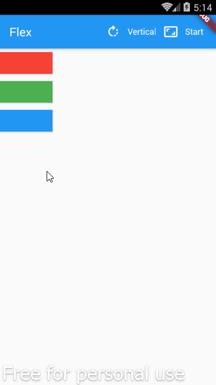

# Example – ‘flex’

From Learn Google Flutter Fast 65 Example Apps book by Mark Clow

## Getting Started

This app uses the Flex layout for the main content – three rectangles. It has a toolbar with
two buttons. The first button allows the user to toggle the Flex axis between vertical
and horizontal. The second button allows the user to change the value of the main axis alignment.

