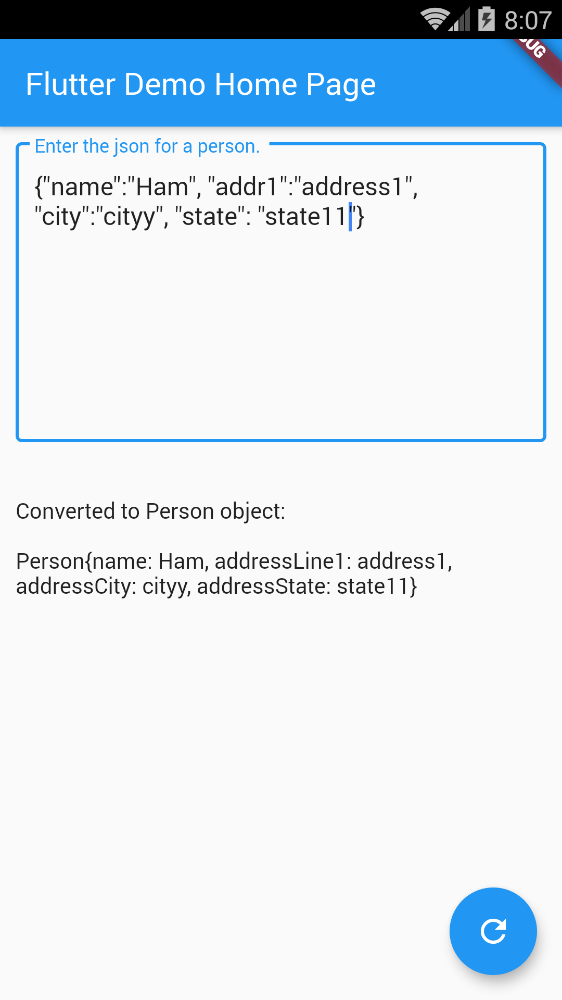

# Example – ‘deserialize_with_generated_code’

From Learn Google Flutter Fast 65 Example Apps book by Mark Clow.

## Getting Started

This app lets you enter the JSON for a person then hit the floating button to deserialize it.
* If successful, a ‘toString()’ of the Person object is displayed underneath (in black). 
* If an error occurs (maybe you input bad JSON?), it is displayed underneath (in red). 

