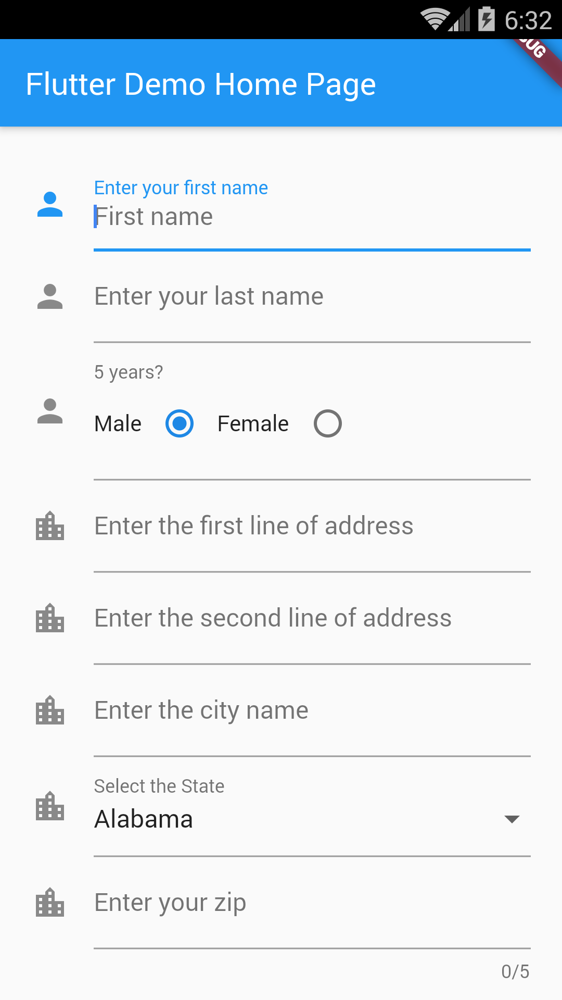
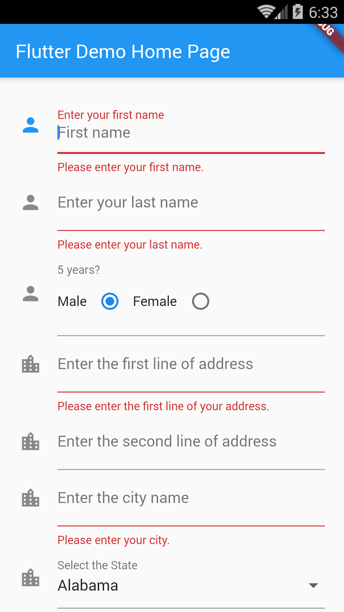
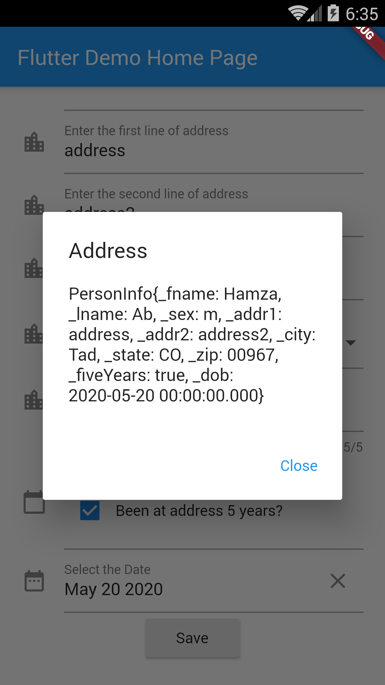

# Example – ‘form_details’

From Learn Google Flutter Fast 65 Example Apps book by Mark Clow.

## Getting Started

This example attempts to use all the input field types: text, radio buttons, checkboxes, selection lists and dates.

