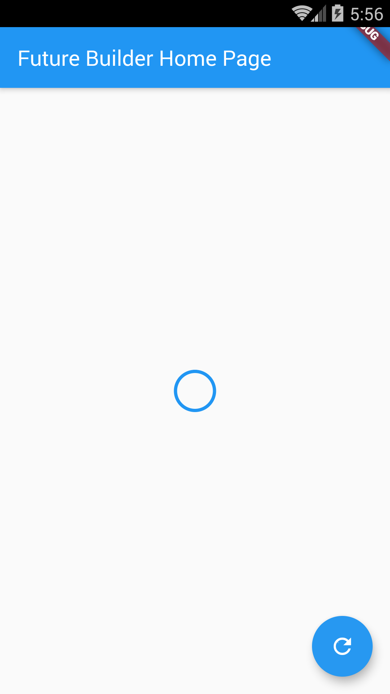
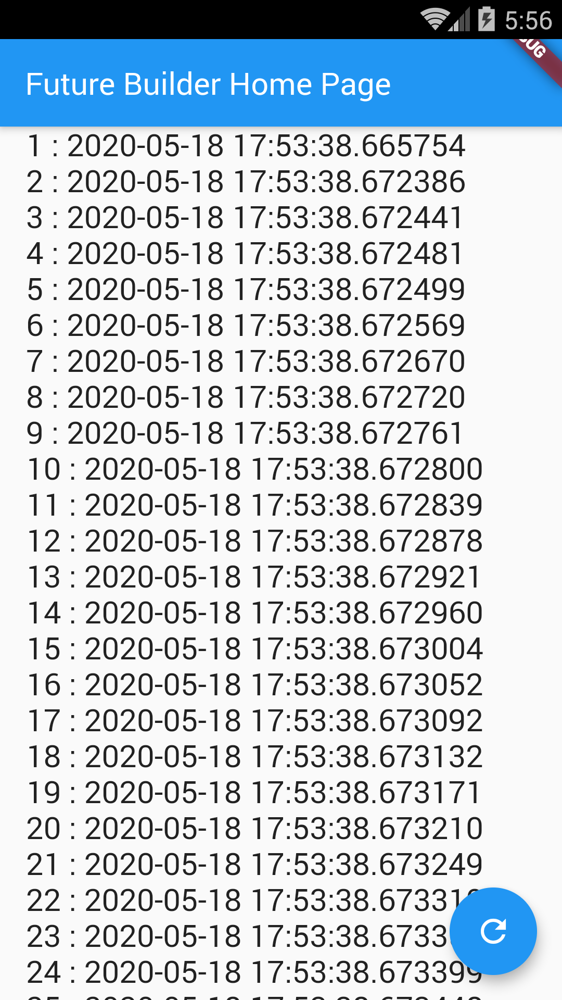

# Example – ‘future_builder_app’

From Learn Google Flutter Fast 65 Example Apps book by Mark Clow.

## Getting Started

This app uses a FutureBuilder to calculates a bunch of timestamps using a Future computation and display it. The screen is blank for a few seconds then it displays a list of times. It’s not terribly pretty!

