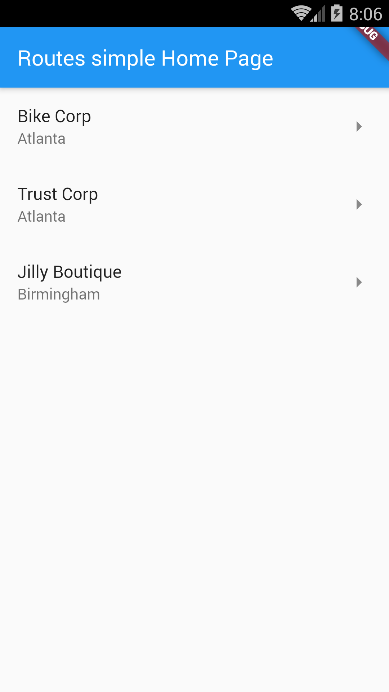
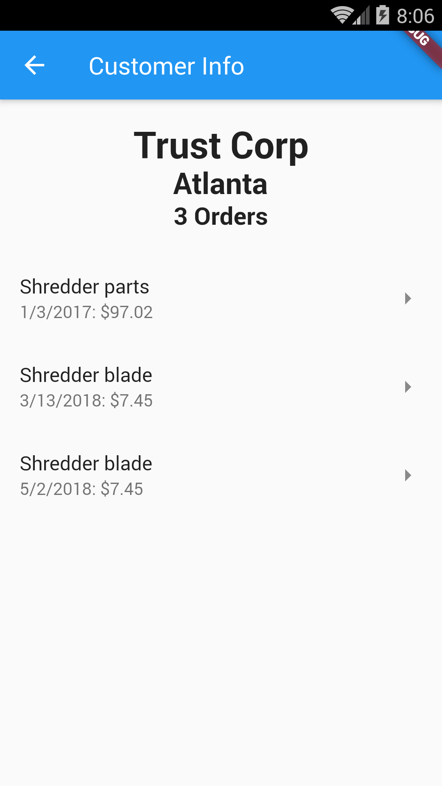

# Example – ‘routes_named’

From Learn Google Flutter Fast 65 Example Apps book by Mark Clow.

## Getting Started

This app looks and feels the same as the routes_simple App example but it does not pass around parameters. It just shows dummy data.

