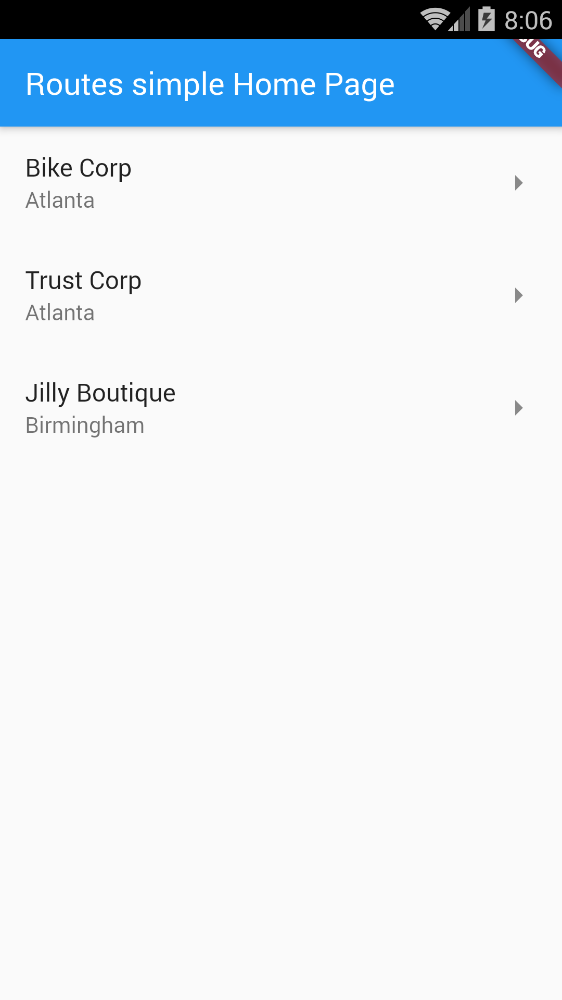

# Example – ‘routes_simple’

From Learn Google Flutter Fast 65 Example Apps book by Mark Clow.

## Getting Started

This example app allows you to navigate from Customers to Customer Info including Orders to Order Info.

