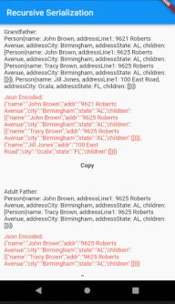

# Example – ‘serialize_with_generated_code’

## Getting Started

This app creates Person objects for all the people in the family and displays a ‘toString()’ of each one (in black). It also deserializes each one, displaying the JSON in underneath (in red). There is a ‘Copy’ button to copy the JSON to the clipboard so you can paste it into an online JSON formatter.

