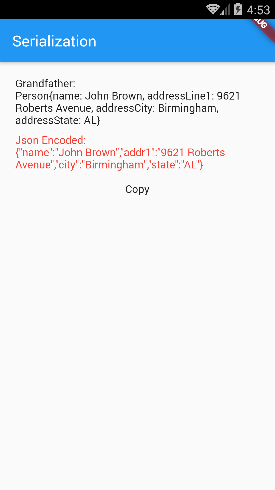

# Example – ‘serialize_with_generated_code’

From Learn Google Flutter Fast 65 Example Apps book by Mark Clow.

## Getting Started

This app creates a Person object for a person and displays a ‘toString()’ of the object below in black. It also serializes that object and displays the JSON in underneath in red. There is a ‘Copy’ button to copy the JSON to the clipboard so you can paste it into an online JSON formatter.

