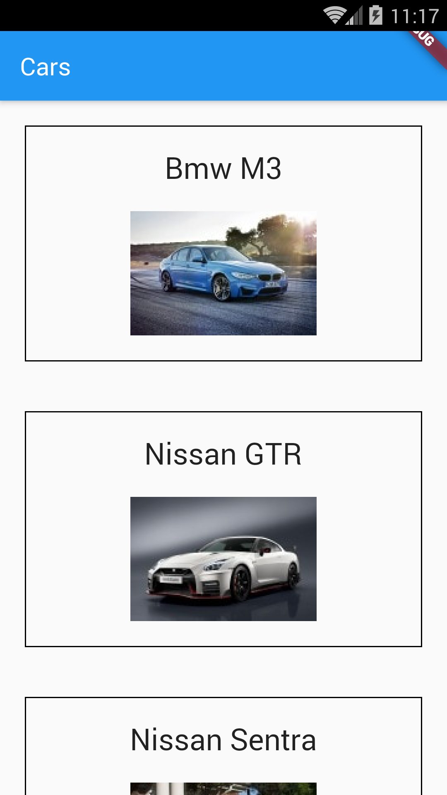

# Example – ‘state_and_inherited_widget_add’

From Learn Google Flutter Fast 65 Example Apps book by Mark Clow.

## Getting Started

In this exercise, I put the state for the car list into CarsInheritedWidget and I access it in CarWidget. 
I add a toolbar button to add another car to the list.

