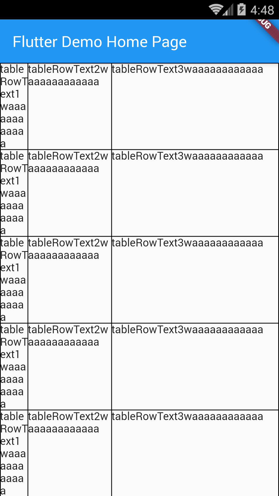

# Example – ‘table’

From Learn Google Flutter Fast 65 Example Apps book by Mark Clow.

## Getting Started

This example shows a table with differently sized columns, text wrapping, as well as scrolling.

