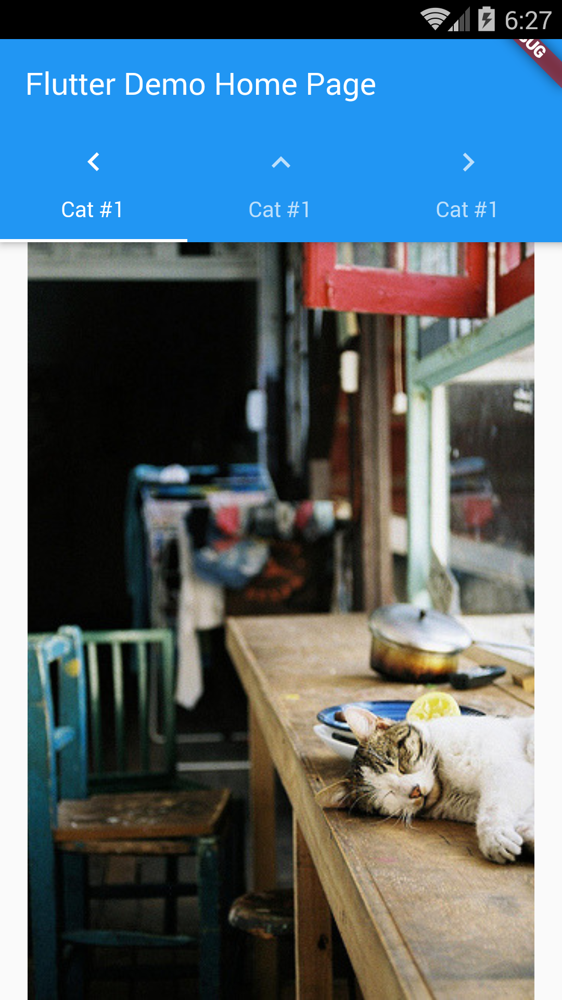

# Example – ‘tabs_simple’

From Learn Google Flutter Fast 65 Example Apps book by Mark Clow.

## Getting Started

The simplest possible app with a simple tabbed interface containing 3 cat pictures. Then we will modify the tab bar.

