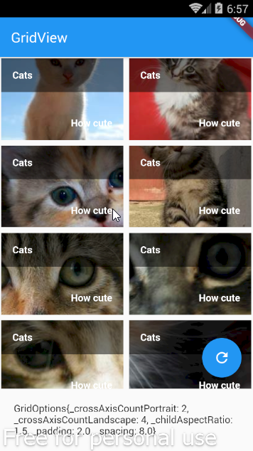
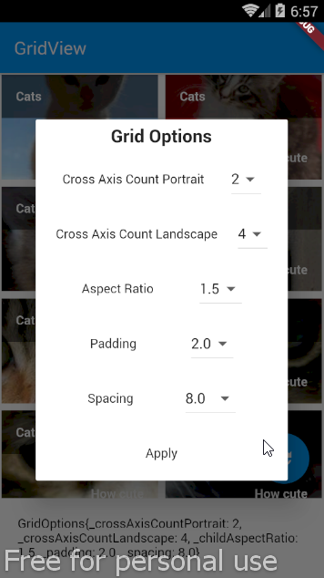

# Example – ‘custom_dialog_gridview_settings’

From Learn Google Flutter Fast 65 Example Apps book by Mark Clow.

## Getting Started

This app shows the grid of cats. It has a button that opens a dialog of the grid options so that the user can change the appearance of the grid.

