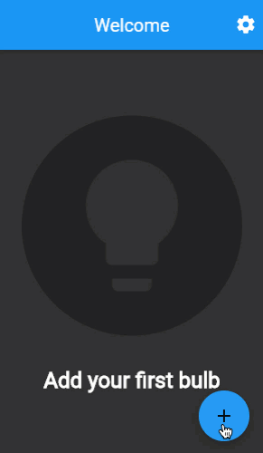

# Example – ‘nested-nav’

## Getting Started

Apps accumulate dozens and then hundreds of routes over time. Some of your routes make sense as top-level (global) routes. For example, “/”, “profile”, “contact”, “social_feed” are all possible top-level routes within your app. But, imagine that you defined every possible route in your top-level Navigator widget. The list would be very long, and many of these routes would be better handled nested within another widget.

Consider an Internet of Things (IoT) setup flow for a wireless light bulb that you control with your app. This setup flow consists of 4 pages: find nearby bulbs, select the bulb that you want to add, add the bulb, and then complete the setup. You could orchestrate this behavior from your top-level Navigator widget. However, it makes more sense to define a second, nested Navigator widget within your SetupFlow widget, and let the nested Navigator take ownership over the 4 pages in the setup flow. This delegation of navigation facilitates greater local control, which is generally preferable when developing software.

The following animation shows the app’s behavior:

