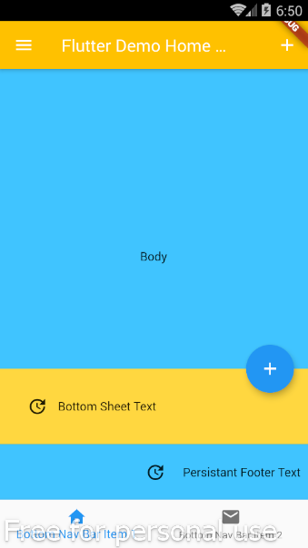

# Example – ‘Scaffold’

From Learn Google Flutter Fast 65 Example Apps book by Mark Clow

## Getting Started

This exercise attempts to use all of the functionality available in the Scaffold Widget.
In doing so it uses all the Widgets that were introduced in 2nd chapter.

